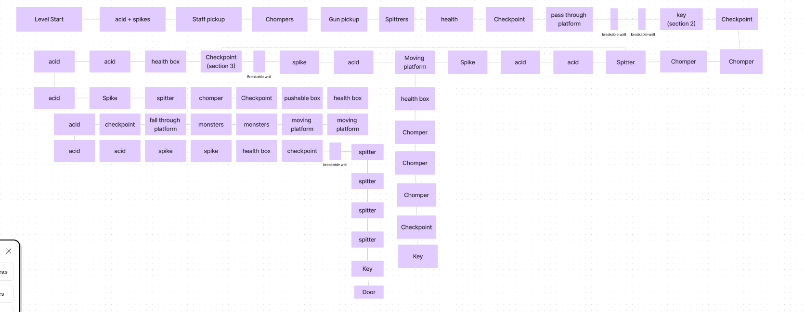
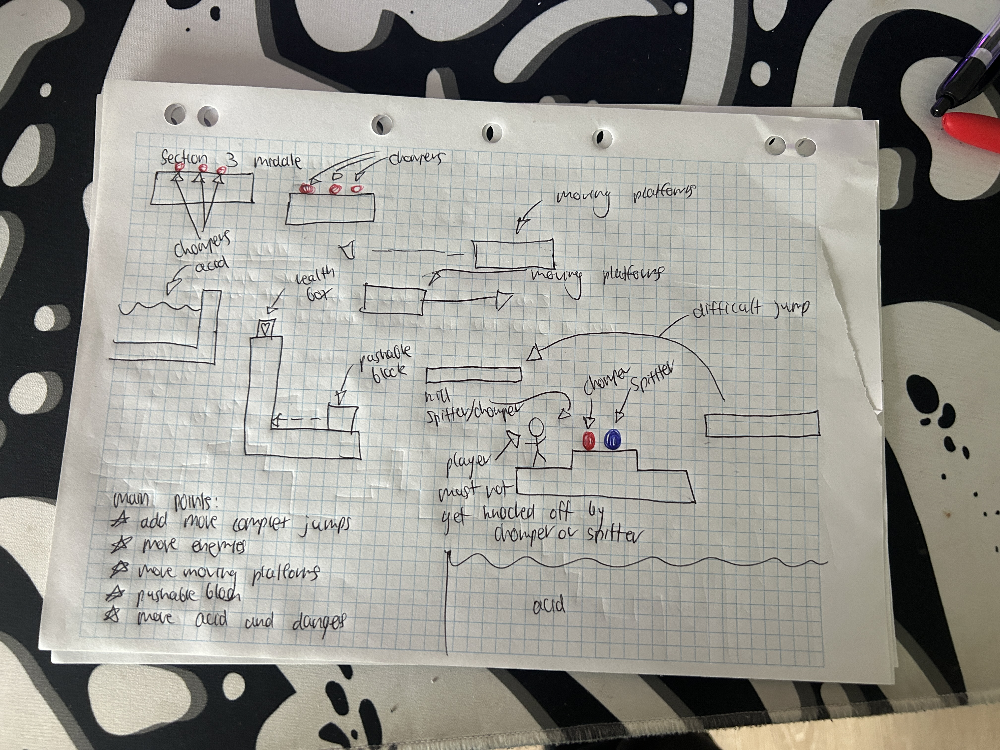
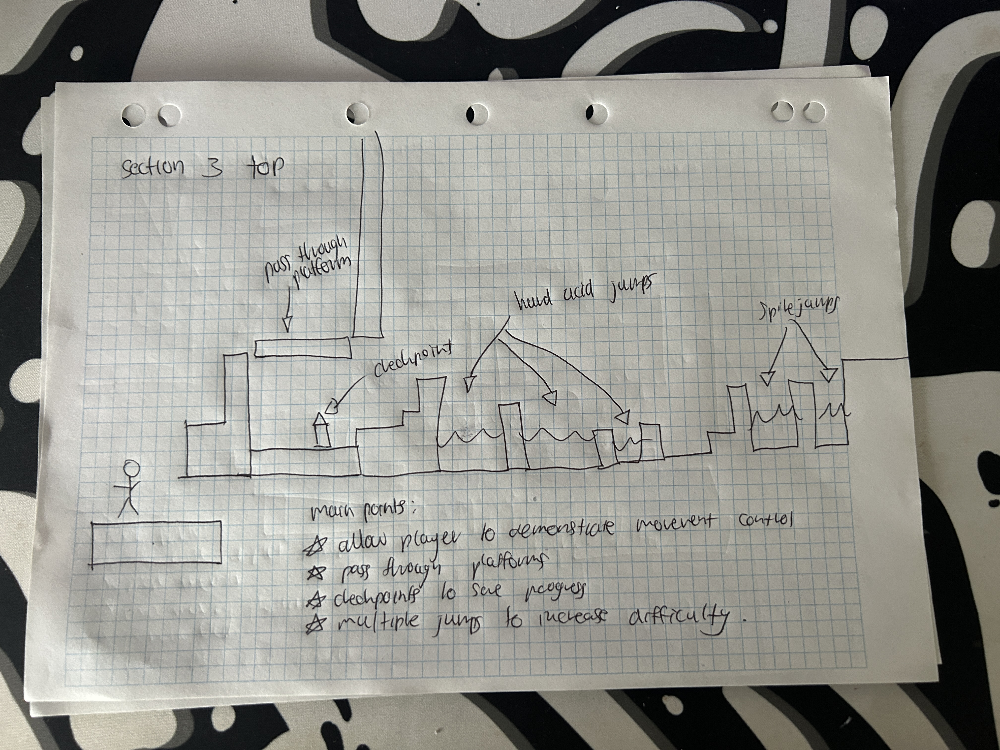
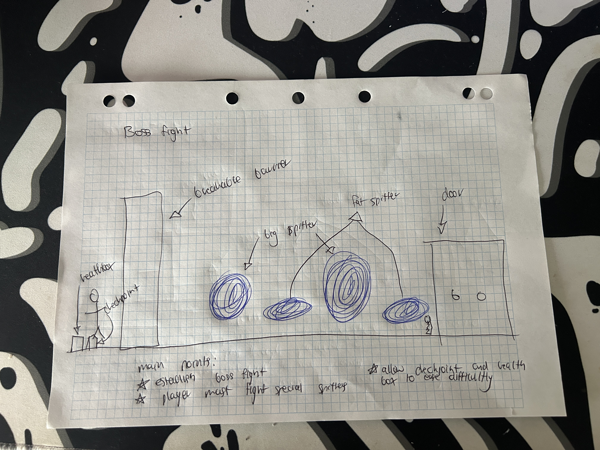

# COMP2150  - Level Design Document
### Name: [Jason Yousif]
### Student number: [47906960] 

## 1. Player Experience (~700 words)

### 1.1. Discovery
Throughout the level, the player experiences discovery with the different mechanics and challenges put in front of them. This is specifically done through the level design which was facilitated to allow the player to discover the levels while still learning how to play the game and achieve the main objective. In the level we see an example of discovery when the player gets given a staff and there is a barrier which says to break it. The player in this part of the level must figure out themselves that they must hit the barrier multiple times for it to break. Moreover, the player through this learns that the two different barriers need a different amount of damage to be broken giving the user necessary knowledge to be able to advance to the more difficult part of the level. 

### 1.2. Drama
Drama is a significant aspect of the game played with the player's emotional stress. Drama is demonstrated through some parts of the levels having harder jumps and more enemies. However, the player can still feel relieved after these hardships by being rewarded with health regens and checkpoints as well as the main objective being the keys. With drama fluctuating throughout the game, it keeps the player immersed in it and allows their undivided attention on it. Moreover, through drama, the creation of each part of the level was made to make it gradually more intense throughout so the player can test their skills and experience more difficulties. A specific time Drama is demonstrated is in the second level where the player must fight multiple chompers who are next to the second key. However, when the chomper’s are defeated, the player is rewarded with the key as well as a health regen to modulate the intensity. This also gives the player hope to continue in the level and further progress. 

### 1.3. Challenge
Challenge is another key aspect of the game, which captivates the player and allows for the player to be entertained. Throughout the level, the difficulty becomes gradually harder, challenging the player more. By utilizing the aspect of challenge, the player is able to figure out strategy and different ways to play the game to get past these challenges. However, modulating the challenge so it is not too difficult is highly significant as the player still should be given hope. Moreover, by making the level progressively more challenging it allows the player to not give up straight away and persevere. By doing this i am allowing the player to stay in the flow channel and continue playing the game, in order to reach the end. A part of the level where challenge is shown is in the last section where the player must jump from a moving platform to a platform with multiple chompers which can hit the player off into acid. This challenge intrigues the player and allows them to use their problem-solving abilities to get past. 

### 1.4. Exploration
Exploration is also another key part of the players' experience. Exploration is used throughout the entirety of the level to engage the player and allow them to discover the levels at their own pace. The aesthetics and layout choices allow for players to explore as there are different elevations and distinct types of level structures. Through these unique level structures, it engages the player allowing them to explore and find the key in their own way. Moreover, the level has many different ways to be done giving the player numerous options on how they want to face the challenges. Exploration is seen in the second part of the level where the player has multiple separate ways to get down from the top level. By giving the player multiple different options, it allows them to choose their own way of playing the game.

## 2. Core Gameplay (~400 words)

### 2.1 and 2.2 Acid and Spikes

### 2.10 and 2.11 Weapon and Staff pickup

### 2.9 and 2.3 Spitter and Chomper

### 2.5 and 2.2 and 2.4 Health Pickup, Key and Checkpoint

### 2.6 and 2.7 Moving and Passthrough Platforms

## 3. Spatiotemporal Design

### 3.1. Molecule Diagram

### 3.2. Level Map – Section 1

### 3.3.	Level Map – Section 2

### 3.4.	Level Map – Section 3

## 4. Iterative Design (~400 words)
Iterative design was a major factor in the creation of the game. Through iterative design i was able to prototype, test and analyze the level a numerous number of times until the best version of the game was created. Through iterative design many bugs and changes were made to the initial level as most of the jumps and platform were either too easy to reach or too difficult. Moreover, through the use of paper prototypes and story boards it became much easier to visualize the level and have a base to build apon. Continuing the use of storyboards and paper prototypes also allowed for the main idea to come to life much quicker, making the process of making the game much simpler and easy to execute, compared to starting with none of these additional aids. As seen below with the additional story boards and paper prototypes, the encounters are outlined and demonstrated in a way which would allow for changes to be made. This was done intentionally as the first design is never going to be perfect and it will always need to be improved on and checked a numerous number of times. In unity after creating the initial level there were numerous numbers of updates which said cleaning up or fixing bugs. These updates were created because of iterative design and the process of testing and analyzing multiple factors of the game. A specific encounter which could be improved in my level is in the last section of the level where the player must fight the larger chompers and spitters to achieve the final key. This encounter could be improved by giving the chompers and spitters more health and buffed stats in order for it to be much harder for the player to achieve the final key to finishing the level. Moreover, this encounter could also have more dynamics making it less straight forward for the player to kill the chompers and spitters. An example of this would be making the spitters shoot a larger radius of slime making it harder for the player to dodge and evade. Moreover, the use of barricades in the final encounter would also add more dynamic to the level. Therefore, through iterative design I have been able to create a game that is playable and enticing through the use of prototyping, testing as well as analyzing. 

Section 1

Section 2

Section 3

